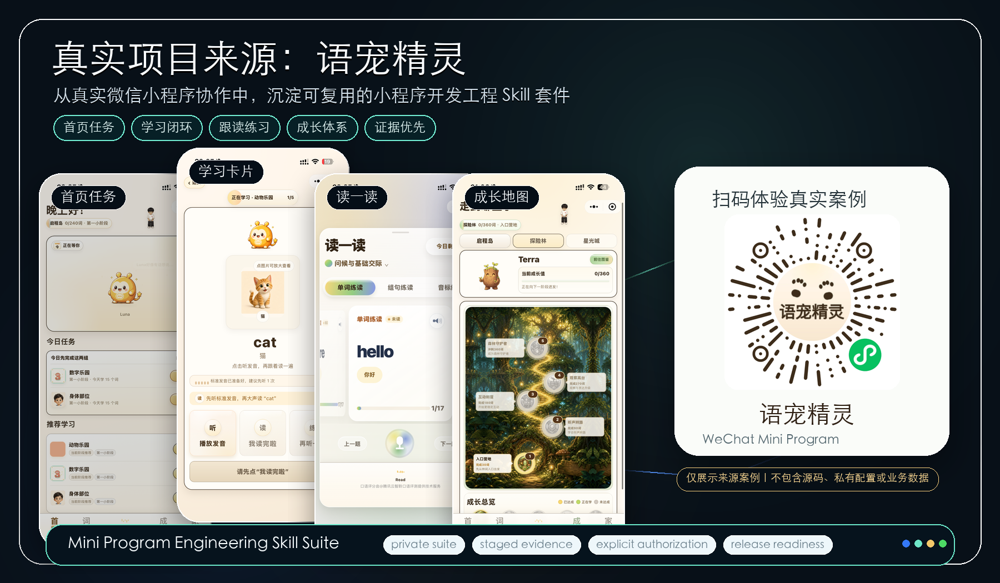

<p align="center">
  
</p>

# Mini Program Engineering Skill Suite

<p align="center">
  
  
  
  
  
  
  
  
  
  
</p>

<p align="center">
  <a href="./README.md">中文</a> ·
  <a href="./README.zh-Hant.md">繁體中文</a> ·
  <a href="./README.en.md">English</a> ·
  <a href="./README.ja.md">日本語</a> ·
  <a href="./README.th.md">ไทย</a> ·
  <a href="./README.id.md">Bahasa Indonesia</a>
</p>

**Mini Program Engineering Skill Suite** is an Agent Skill suite for zero-to-one mini-program development, existing project takeover, and release-readiness governance. It turns the hard parts of mini-program work into an executable agent workflow: clarifying what should be built, deciding how it should be built, proving what has been done, and keeping external actions explicitly authorized.

中文名：**小程序开发工程技能套件**。

---

## Highlights

- **Three-platform fact layer**: a single source of truth for WeChat / Alipay / Douyin platform rules, with capability doctor auto-detecting the project stack and target platform. Detection capability is labeled honestly: WeChat supports deterministic fingerprint monitoring, while Alipay / Douyin rely on runtime checks against official docs and user reports instead of pretending to auto-detect (see [Platform Rule Freshness](#platform-rule-freshness)).
- **Platform rule freshness pipeline**: execution always aligns with current official docs at run time, while the content layer runs weekly automated drift detection (fingerprint comparison → extraction → consistency audit → verdict issue). A slightly outdated local install never causes a task to follow stale rules (see [Platform Rule Freshness](#platform-rule-freshness)).
- **Full gate verification on real agent CLIs**: the three-tier release gates (structure / routing / behavior) and independent signing run in real agent CLI sessions — early versions were acceptance-tested through Codex CLI, and the evaluation engine is now pluggable (Codex CLI / Claude Code / Gemini / OpenAI-compatible API). Passing across engines is stronger evidence (see [Verification](#verification) and [EVALUATIONS.md](EVALUATIONS.md)).
- **Evidence-first engineering discipline**: every status claim must be backed by matching evidence, otherwise it is honestly labeled unknown. Since 3.0 this discipline ships as a domain-neutral foundation skill layer (`foundation/`) that any agent engineering suite can reuse (see [Design Principles](#design-principles)).
- **Tiered evaluation with independent signing**: tier1 structure / tier2 routing / tier3 behavior evaluations, independent with-skill vs. baseline judgment, and held-out batches that stay frozen until release — every gate must PASS before shipping (see [EVALUATIONS.md](EVALUATIONS.md)).
- **Supply-chain-grade release governance**: SHA256 checksums, dual manifests, fail-closed packaging, receiver-side re-verification, and a sensitive-content scan with zero findings; six-language README structure consistency is enforced by script (see [Package Integrity](#package-integrity)).

---

## Understand the Skill in 32 Seconds

If you want a quick overview of what this Skill solves, where it came from, and how it is meant to be used, start with this [32-second explainer video](https://raw.githubusercontent.com/NocodeMrLi/mini-program-engineering-skill-suite/main/assets/readme-promo.mp4).

https://github.com/user-attachments/assets/d382951e-5175-48be-b0c0-44ba210706f1

<sub>The video only explains the suite positioning, origin, and usage boundaries.</sub>

---

## Status

This repository is the public project home for the suite, released under the **MIT License**. Anyone may view, use, modify, and redistribute it. See [LICENSE](LICENSE) for the full terms.

---

## What It Solves

Mini-program development is harder than it looks for people who have never shipped one before. The challenge is not just writing code; it is knowing what to confirm first, which decisions affect later work, when to stop and verify, and which release steps should never be skipped by assumption.

The suite helps an agent guide that process from zero to one, or take over an existing project without damaging accepted work:

- clarify product intent, users, scope, and acceptance criteria before building;
- turn vague ideas into testable specifications and engineering plans;
- map stable decisions into architecture, data, API, permission, and failure-handling choices;
- implement scoped changes while preserving existing work;
- check UI, device behavior, permissions, and release risks step by step;
- diagnose issues from evidence instead of guessing;
- report only what has actually been verified.

---

## Real Project Origin: WordPet

This Skill suite was not written from an abstract tutorial. It was distilled from long-running collaboration on the real WeChat mini program **WordPet（语宠精灵）**. What this repository preserves is the reusable engineering method: product decomposition, scoped implementation, verification, acceptance evidence, release readiness, and status discipline for mini-program work.

<p align="center">
  
</p>

<sub>WordPet（语宠精灵）is shown only as the real-origin case behind the method. This repository publishes reusable mini-program engineering practices only. It does not include the app source code, AppID, cloud resources, private configuration, business data, review status, or internal development records. The QR code is provided only for experiencing the real case, and scan results depend on the current WeChat platform state.</sub>

---

## Component Map

| Area | Purpose |
| --- | --- |
| Project intake | Read-only project discovery, fact map, risk map, and change boundary |
| Product specification | MVP scope, user flow, state matrix, acceptance criteria |
| Architecture | Module, data, API, permission, and failure strategy decisions |
| Platform adaptation | WeChat mini-program tooling, privacy, permissions, and platform evidence |
| Implementation | Small scoped changes with tests and user-change protection |
| UI and device adaptation | Reference fidelity, preview-first changes, responsive/device checks |
| Debugging | Reproduction, competing hypotheses, root-cause isolation, regression coverage |
| Verification | Evidence tiers across static checks, unit tests, integration, simulator, device, cloud, and release layers |
| Release readiness | Version, build, security, privacy, rollback, upload/review/release evidence governance |

---

## Design Principles

- Facts before action: no edits before the current project state is understood.
- Evidence-calibrated status: report only the state that has actually been proven.
- Stage gates stay separate: preview, implementation, build, upload, review, acceptance, release, and rollback are not interchangeable.
- Authorization is explicit: external writes such as upload, review submission, release, cloud changes, and repository publishing require separate approval.
- Private information stays out: public packages must pass redaction and sensitive-content checks.
- Real devices still matter: local, static, and simulated checks cannot replace device, cloud, experience-version, or production evidence.
- Platform-rule freshness (new in 2.0): execution follows the current official rules; bundled rules are a cache, never the authority.

---

## Platform Rule Freshness

Platform rules keep changing, so any rule hardcoded into a skill goes stale. Since 2.0 the suite follows "fresh at execution, controlled in evolution":

- **Execution always defers to the official source.** For platform-touching steps (upload, review submission, release, privacy declarations, quotas), the agent first checks whether the recorded platform facts are still fresh (each fact carries a verification date and source fingerprint); stale or high-risk steps check the current official documentation before executing. **A slightly outdated local install never causes a task to follow stale rules** — it only changes how often official sources are consulted, never correctness.
- **Suite content evolves under control.** The maintainer detects rule changes with drift tooling (fingerprint comparison against official pages) and lands updates through multi-round independent audits; you can report a rule change you spotted via the **Platform rule drift** issue template (voluntary, pre-filled).
- **Want the latest copy?** Download the new package from [Releases](https://github.com/NocodeMrLi/mini-program-engineering-skill-suite/releases) and reinstall with `install.sh --force`. The suite never silently auto-updates a local install.

Platform facts and the rule map live in the `platforms/` directory, now covering WeChat, Alipay, and Douyin. WeChat supports deterministic fingerprint monitoring with weekly automated drift detection; the Alipay and Douyin doc centers are client-rendered, so deterministic fingerprints cannot observe content changes and they are honestly marked `manual-only` — freshness there relies on runtime checks against official docs and user reports rather than pretending to auto-detect. Platforms outside the map are always checked against official sources and kept `unknown`, never guessed.

---

## Intended Use

The suite is intended for agents working with mini-program engineering tasks, especially when a project has accumulated product decisions, UI conventions, platform constraints, and release risk over time.

Typical use cases include:

- taking over an unfamiliar mini-program repository;
- planning a new mini-program from zero to one;
- implementing a feature without disturbing existing accepted work;
- checking whether a project is ready for upload, review, or release;
- turning repeated engineering judgment into reusable agent behavior.

---

## How To Use

### 1. Install Into An Agent App

Prefer downloading the verified public package from [GitHub Releases](https://github.com/NocodeMrLi/mini-program-engineering-skill-suite/releases). If you want to inspect source, contribute changes, or let an agent handle the setup, clone this repository into an application that supports `SKILL.md` or project rules.

If you do not want to run commands manually, paste this request into the agent app you are using. If the agent has network, Git, and local filesystem write access, it can usually choose the right install location and install the skill for you:

```text
https://github.com/NocodeMrLi/mini-program-engineering-skill-suite.git Install this skill for me.
```

If the agent cannot access your local filesystem, or if you want to control the exact install location, use the installer or command-line examples below.

| App / runner | Recommended location | Invocation |
| --- | --- | --- |
| Codex App / Codex local skills | `~/.codex/skills/mini-program-engineering-suite` | `/mini-program-engineering-suite` |
| Universal Agent Skills | `~/.agents/skills/mini-program-engineering-suite` | `/mini-program-engineering-suite` |
| Claude Code | `~/.claude/skills/mini-program-engineering-suite` | `/mini-program-engineering-suite` |
| GitHub Copilot Coding Agent | `.github/skills/mini-program-engineering-suite` | Trigger through the repository task and Skill instructions |
| Cursor | `.cursor/rules/mini-program-engineering-suite` | Use as project rules / Skill instructions |
| Windsurf / Cline / Roo Code / Gemini CLI / Kiro / Trae / Goose / OpenCode | The app's skills or rules directory | Trigger through that app's Skill / Rules mechanism |

Installer example:

```bash
git clone https://github.com/NocodeMrLi/mini-program-engineering-skill-suite.git
cd mini-program-engineering-skill-suite
bash install.sh --target auto
```

For project-level GitHub Copilot or Cursor installation, pass the project path explicitly:

```bash
bash install.sh --target codex
bash install.sh --target agents
bash install.sh --target copilot --project /path/to/your-mini-program-project
bash install.sh --target cursor --project /path/to/your-mini-program-project
```

Here, `--target codex` maps to `~/.codex/skills`, while `--target agents` maps to `~/.agents/skills`.

The installer does not overwrite existing directories by default. Use `--force` only when you want to replace an existing installation after creating a timestamped backup.

Universal install example:

```bash
git clone https://github.com/NocodeMrLi/mini-program-engineering-skill-suite.git \
  ~/.agents/skills/mini-program-engineering-suite
```

Claude Code example:

```bash
git clone https://github.com/NocodeMrLi/mini-program-engineering-skill-suite.git \
  ~/.claude/skills/mini-program-engineering-suite
```

GitHub Copilot project-level example:

```bash
mkdir -p .github/skills
git clone https://github.com/NocodeMrLi/mini-program-engineering-skill-suite.git \
  .github/skills/mini-program-engineering-suite
```

### 2. Invoke It In A New Session

After installation, open a new agent session and describe the task. You can explicitly call the root Skill:

```text
/mini-program-engineering-suite I want to build a WeChat mini program from zero to one. Please help me clarify scope and development steps first.
```

You can also describe a stage-specific task and let the agent route to the right component:

```text
Take over this mini-program project read-only first. Inspect the current state, but do not change code yet.
```

```text
This mini program is preparing for review. Run a release-readiness check, but do not upload or submit review.
```

### 3. Work In Stages

The recommended flow is product specification, architecture, implementation, UI/device adaptation, verification, and release readiness. At each stage, ask the agent to report:

- the current conclusion;
- the files, tests, screenshots, logs, or platform evidence behind it;
- what has not been verified yet;
- what needs your confirmation next.

For existing projects, start with read-only project intake before changing anything. External actions such as upload, review submission, release, cloud changes, and repository permission changes require separate authorization.

---

## What It Does Not Do

This suite does not automatically install project dependencies, create cloud resources, upload packages, submit review, publish releases, or modify production state. It can prepare evidence and instructions for those actions, but each external action remains separately authorized.

---

## Verification

The current suite version uses structural validation, sensitive-content scanning, deterministic public-package export, manifest verification, routing evaluation, behavior evaluation, and independent final judgment before release.

Evaluation layers, evidence boundaries, and per-release public summaries are documented in [EVALUATIONS.md](EVALUATIONS.md). The evaluation engine and model are pluggable (any available one of codex / claude / gemini / OpenAI-compatible APIs can serve as the tested or judging engine); audit metadata records the engine and model actually used. Passing across engines is stronger evidence; scores are not compared across engine classes.

For a received package, integrity is checked through its `package-manifest.json`. For a source working copy, validation and sensitive scanning are run before distribution.

After cloning this repository, you can run the zero-dependency local checks:

```bash
python3 -m unittest discover -s tests -q
python3 scripts/validate_suite.py .
python3 scripts/check_i18n_readme_structure.py .
python3 scripts/scan_sensitive_content.py . --format json
```

Before release or distribution, also run deterministic export and recipient-side verification:

```bash
export_dir="$(mktemp -d)"
python3 scripts/export_public_package.py . --output "$export_dir/package"
python3 "$export_dir/package/scripts/verify_public_package.py" "$export_dir/package"
```

These commands are also the core GitHub Actions CI gates.

---

## Package Integrity

Prefer versioned packages from [GitHub Releases](https://github.com/NocodeMrLi/mini-program-engineering-skill-suite/releases). Each release includes the public package archive, `package-manifest.json`, and `SHA256SUMS` so you can confirm that downloaded assets were not corrupted or mixed with another version.

Verify release assets. On Linux / GitHub Actions:

```bash
sha256sum -c SHA256SUMS
```

On macOS:

```bash
shasum -a 256 -c SHA256SUMS
```

Then extract the archive and verify the package manifest:

```bash
tar -xzf mini-program-engineering-suite-v3.1.6.tar.gz
python3 mini-program-engineering-suite-v3.1.6/scripts/verify_public_package.py \
  mini-program-engineering-suite-v3.1.6
```

If you receive a package through another channel, use its `package-manifest.json` to recompute every file size and SHA-256 digest:

```bash
python3 <package-dir>/scripts/verify_public_package.py <package-dir>
```

The command confirms package integrity only; it does not prove publisher identity, device behavior, platform approval, or production release state. Keep the previous verified package and its manifest digest so rollback (回滚) remains possible if a later version regresses.

---

## Version

Current working version: **3.1.6**.

---

## License

This project is released under the **MIT License**. See [LICENSE](LICENSE) for details. You are free to use, modify, distribute, and commercially use it, provided you retain the copyright notice and permission notice.
