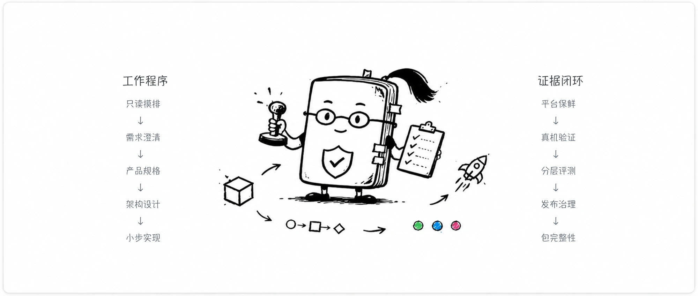

<p align="center">
  
</p>

# Mini Program Engineering Skill Suite

<p align="center">
  
  
  
  
  
  
  
  
  
  
</p>

<p align="center">
  <a href="./README.md">中文</a> ·
  <a href="./README.zh-Hant.md">繁體中文</a> ·
  <a href="./README.en.md">English</a> ·
  <a href="./README.ja.md">日本語</a> ·
  <a href="./README.th.md">ไทย</a> ·
  <a href="./README.id.md">Bahasa Indonesia</a>
</p>

**Mini Program Engineering Skill Suite** adalah kumpulan Agent Skill untuk membantu pengembangan WeChat Mini Program dari nol, mengambil alih proyek yang sudah ada, dan menyiapkan rilis dengan bukti yang jelas. Suite ini memecah pekerjaan menjadi alur yang dapat dieksekusi: apa yang harus dikonfirmasi, bagaimana membangunnya, sejauh mana pekerjaan sudah selesai, dan bukti apa yang tersedia.

Nama Tionghoa: **小程序开发工程技能套件**.

> Catatan: suite ini saat ini berpusat pada metode engineering untuk WeChat Mini Program. Untuk LINE MINI App, Telegram Mini Apps, Alipay+ Mini Program, atau ekosistem mini app lain, prinsipnya dapat dijadikan referensi, tetapi aturan platform, permission, pembayaran, dan runtime tetap perlu diadaptasi secara terpisah.

---

## Pahami Skill Ini dalam 32 Detik

Jika Anda ingin melihat gambaran singkat tentang masalah yang diselesaikan, asal-usulnya, dan cara penggunaannya, mulai dari [video penjelasan 32 detik](https://raw.githubusercontent.com/NocodeMrLi/mini-program-engineering-skill-suite/main/assets/readme-promo.mp4) ini.

https://github.com/user-attachments/assets/73f542b6-f90d-4f1b-bb75-bb19db341dc5

<sub>Video ini hanya menjelaskan posisi suite, asal-usul, dan batas penggunaannya.</sub>

---

## Status Proyek

Repository ini adalah halaman publik untuk suite ini dan dirilis dengan **MIT License**. Siapa pun dapat melihat, menggunakan, mengubah, dan mendistribusikannya kembali. Lihat [LICENSE](LICENSE) untuk detailnya.

---

## Masalah yang Diselesaikan

Bagi orang yang belum pernah mengirimkan mini program, tantangan utamanya bukan hanya menulis kode. Yang sulit adalah mengetahui apa yang perlu dikonfirmasi terlebih dahulu, keputusan mana yang berdampak ke tahap berikutnya, kapan harus berhenti untuk memverifikasi, dan langkah rilis mana yang tidak boleh dilewati berdasarkan asumsi.

Masalah umum:

- environment dan konfigurasi tidak konsisten；
- permission atau privacy policy baru diketahui kurang setelah siap rilis；
- UI terlihat benar di simulator tetapi rusak di perangkat nyata；
- build, submission, acceptance, dan release tercampur；
- perubahan yang belum disetujui terdorong ke online dan perlu rollback cepat.

Suite ini membantu Agent mengubah risiko tersebut menjadi alur engineering: memahami tujuan dan batas, membuat spesifikasi dan rencana, melakukan perubahan kecil, memverifikasi bertingkat, lalu menutup risiko rilis. Suite ini tidak menggantikan keputusan bisnis atau produk, tetapi membantu pengguna tahu langkah berikutnya, alasan langkah itu diperlukan, dan bukti apa yang cukup.

---

## Asal dari Proyek Nyata: WordPet

Skill ini tidak ditulis dari tutorial abstrak. Ia disarikan dari kolaborasi jangka panjang pada WeChat Mini Program nyata bernama **WordPet**. Yang dipublikasikan di sini adalah metode engineering yang dapat digunakan ulang: pemecahan produk, implementasi bertahap, verifikasi, acceptance, kesiapan rilis, dan manajemen bukti.

<p align="center">
  
</p>

<sub>WordPet ditampilkan hanya sebagai contoh asal-usul metode. Repository ini tidak menyertakan source code aplikasi, AppID, cloud resources, konfigurasi privat, data bisnis, status review, atau catatan pengembangan internal. Kode QR hanya disediakan untuk mencoba contoh nyata, dan hasil pemindaian bergantung pada status platform WeChat saat ini.</sub>

---

## Yang Dibantu untuk Agent

- **Mengambil alih proyek**: memahami status sebelum mengubah apa pun；
- **Memperjelas kebutuhan**: mengubah ide kabur menjadi spesifikasi yang dapat diterima；
- **Mencatat keputusan**: menurunkan keputusan produk ke architecture, data, API, permission, dan fallback；
- **Mengubah kode dengan aman**: perubahan kecil, terukur, dan dapat di-rollback；
- **Verifikasi bertahap**: membedakan UI preview, konfirmasi pengguna, integrasi, perangkat, dan final acceptance；
- **Debug berbasis bukti**: mencari masalah dari evidence, bukan dugaan；
- **Melapor dengan jujur**: hanya menyatakan apa yang benar-benar sudah diverifikasi.

---

## Peta Kemampuan

| Area | Tujuan |
| --- | --- |
| Project intake | Read-only discovery, fact map, risk map, dan change boundary |
| Product specification | MVP scope, user flow, state matrix, acceptance criteria |
| Architecture | Module, data, API, permission, dan failure strategy |
| Platform adaptation | Tooling WeChat Mini Program, privacy, permission, dan platform evidence |
| Implementation | Perubahan kecil dengan test dan perlindungan pekerjaan yang sudah diterima |
| UI and device adaptation | Preview-first, responsive, dan pengecekan multi-perangkat |
| Debugging | Reproduction, competing hypotheses, root cause, dan regression coverage |
| Verification | Evidence tiers untuk static, unit, integration, simulator, device, cloud, dan release |
| Release readiness | Version, build, security, privacy, rollback, upload / review / release governance |

---

## Prinsip Desain

- Fakta sebelum tindakan: jangan mengubah proyek lama sebelum statusnya jelas.
- Status mengikuti bukti: hanya laporkan hal yang sudah diverifikasi.
- Tahap tidak boleh dicampur: preview, implementation, build, upload, review, acceptance, dan release adalah tahap berbeda.
- External action perlu izin terpisah: cloud change, upload, submit review, dan publish harus disetujui satu per satu.
- Informasi privat dipisahkan: public package dan README assets harus melewati sensitive-content scan.

---

## Cara Menggunakan

Clone repository ini ke direktori skill atau rules pada aplikasi Agent yang mendukung `SKILL.md`. Jika tidak ingin menjalankan perintah sendiri, kirim kalimat berikut ke Agent yang Anda gunakan:

```text
https://github.com/NocodeMrLi/mini-program-engineering-skill-suite.git bantu saya menginstal skill ini
```

Contoh instalasi:

```bash
git clone https://github.com/NocodeMrLi/mini-program-engineering-skill-suite.git \
  ~/.agents/skills/mini-program-engineering-suite
```

Setelah instalasi, buka sesi Agent baru dan jalankan:

```text
/mini-program-engineering-suite Saya ingin membuat WeChat Mini Program dari nol. Bantu mulai dari scope produk dan langkah pengembangan.
```

---

## Yang Tidak Dilakukan

Suite ini tidak otomatis menginstal dependency, membuat cloud resources, mengunggah package, mengirim review, merilis versi, atau mengubah status online. Setiap external write action tetap membutuhkan otorisasi terpisah.

---

## Verifikasi

Sebelum dianggap siap dibekukan, suite ini melewati structural validation, sensitive-content scanning, deterministic public-package export, manifest verification, routing evaluation, behavior evaluation, dan independent final judgment.

Pemeriksaan lokal:

```bash
python3 -m unittest discover -s tests -q
python3 scripts/validate_suite.py .
python3 scripts/check_i18n_readme_structure.py .
python3 scripts/scan_sensitive_content.py . --format json
```

---

## Integritas Paket

Utamakan package berversi dari [GitHub Releases](https://github.com/NocodeMrLi/mini-program-engineering-skill-suite/releases). Setiap Release menyertakan archive, `package-manifest.json`, dan `SHA256SUMS`. Di Linux / GitHub Actions gunakan `sha256sum -c SHA256SUMS`; di macOS gunakan `shasum -a 256 -c SHA256SUMS`. Setelah diekstrak, verifikasi ulang manifest dengan `verify_public_package.py` di dalam package.

Untuk memeriksa package yang diterima:

```bash
python3 <package-dir>/scripts/verify_public_package.py <package-dir>
```

---

## Versi

Versi saat ini: **1.3.0**.

---

## Lisensi

Lisensi: **MIT License**.
