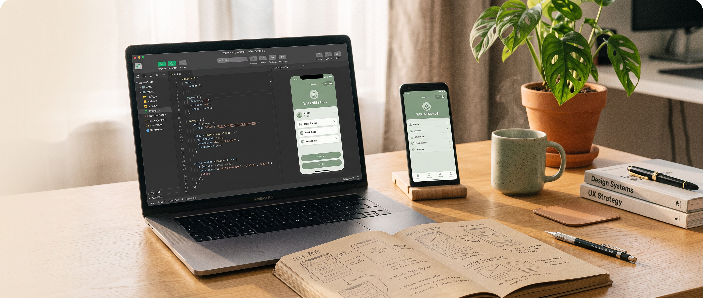

[English](./README.en.md) | **中文**

---

<p align="center">
  
</p>

# 小程序开发工程技能套件

<p align="center">
  
  
  
  
  
  
  
  
  
</p>

**小程序开发工程技能套件** 是一套面向 Agent 的技能套件，专为小程序从 0 到 1 开发、已有项目接管和上线前治理设计。它把「先弄清楚要做什么、怎么做、做到哪一步、有没有证据」这条链路拆成可执行的工程流程，帮助不熟悉小程序开发的人在 Agent 辅助下少踩坑、少返工、不越权。

英文名：**Mini Program Engineering Skill Suite**。

---

## 项目状态

本仓库是这套套件的公开项目主页，已通过 **MIT License** 开源发布。任何人都可以查看、使用、修改和再分发，具体条款见 [LICENSE](LICENSE)。

---

## 它解决了什么问题

做小程序这件事，对没接触过的人来说远比看上去复杂。真正难的往往不是写某一段代码，而是从一开始就不知道该先确认什么、哪些决策会影响后面、什么时候该停下来验证，以及上线前哪些事不能凭感觉跳过。

工具链分散、平台规则琐碎、上线审核环环相扣。无论你是第一次做小程序的产品经理 / 创业者，还是临时接手老项目的开发者，往往会在这些地方反复踩坑：

- 环境装到一半报错、配置前后不一致；
- 上线之后才发现权限漏配，临时补隐私协议；
- UI 在不同机型上严重错位，真机表现和模拟器完全两个样子；
- 提审版本和发布版本混淆，误把没验收的代码送审；
- 误操作把没确认的改动推到了线上，要紧急回滚……

**小程序开发工程技能套件** 把这些容易踩坑的环节打包成 Agent 可以直接执行的工程能力：先梳理目标和边界，再形成产品规格和工程方案，然后小步实现、分层验证、收口发布风险。**它不替你做商业和产品决定，但能让一个不懂小程序开发的人在 Agent 的辅助下走完从 0 到 1 的关键路径，知道下一步该做什么、为什么做、做到什么程度才算有证据。**

---

## 真实项目来源：语宠精灵

这套 Skill 不是从抽象教程里写出来的，而是从真实微信小程序「语宠精灵」的长期开发协作中提炼出来的。它沉淀的是小程序从 0 到 1 的产品拆解、工程实施、验证验收、发布准备和证据管理方法。

<p align="center">
  
</p>

<sub>「语宠精灵」仅作为真实来源案例展示。本仓库只公开可复用的小程序开发工程方法，不包含该小程序源码、AppID、云资源、私有配置、业务数据、审核状态或内部开发记录。小程序二维码仅用于体验真实案例，扫码结果以微信平台当前状态为准。</sub>

---

## 它帮助 Agent 做到这些事

- **接手项目**：先摸清现有的项目状态再动手改，避免破坏已有功能；
- **澄清需求**：把模糊的产品想法转成可以验收的明确规格；
- **沉淀决策**：把已经定了的产品决策落到架构、数据、接口、权限和兜底逻辑上；
- **安全改代码**：在保留原有成果的前提下，做小颗粒、可回滚的改动；
- **逐级验证**：把 UI 预览、用户确认、集成验证、机型适配、最终验收当成互相不等价的环节；
- **用证据排错**：依据真实证据定位问题，而不是凭感觉猜；
- **如实汇报**：老老实实报告当前验证到了哪一步，不夸大也不省略。

---

## 能力清单

| 模块 | 作用 |
| --- | --- |
| 项目摸排 | 只读地摸清现有项目，输出事实清单、风险清单和变更边界 |
| 产品规格 | MVP 范围、用户流程、状态矩阵、验收标准 |
| 架构设计 | 模块、数据、接口、权限、异常处理策略的统一决策 |
| 平台适配 | 微信小程序工具链、隐私、权限、平台方证据沉淀 |
| 落地实现 | 小颗粒改动 + 测试 + 已验收成果保护 |
| UI 与机型适配 | 设计稿还原、预览先行、响应式 / 多机型核验 |
| 调试排错 | 复现、并列假设、根因定位、防回归验证 |
| 验证 | 静态检查、单元、集成、模拟器、真机、云端、上线多层证据分级 |
| 上线就绪 | 版本、构建、安全、隐私、回滚、上传 / 审核 / 发布证据治理 |

---

## 设计原则

- **事实先于动作**：没摸清现状，别动项目。
- **证据对齐状态**：报什么状态，就得有什么状态被真实验证过。
- **环节边界明确**：预览、实现、构建、上传、审核、验收、上线、回滚 —— 这些环节互相不可替代。
- **外部动作独立授权**：上传、提交审核、发布、云端改动、仓库公开放开等外部写动作，分别独立授权。
- **私有信息隔离**：对外分发的包，必须先过脱敏和敏感信息检查。
- **真机才是真相**：本地检查、静态检查、模拟器都不能替代真机、体验版、生产环境的真实证据。

---

## 适用场景

这套套件适合在以下场景里辅助 Agent 完成小程序工程任务 —— 尤其是当项目已经累积了产品决策、UI 约定、平台约束和发布风险之后。

典型的使用场景包括：

- 接手一个陌生的小程序仓库；
- 从零开始规划一个新小程序；
- 在不破坏已有验收成果的前提下实现一个新功能；
- 检查项目当前是否到了可以上传、提审或发布的状态；
- 把反复出现的工程判断沉淀成可复用的 Agent 行为。

---

## 使用方法

### 1. 安装到支持 Agent Skill 的应用

你可以把本仓库克隆到支持 `SKILL.md` 或项目规则的 Agent 应用目录中。不同应用的具体识别能力会随版本变化，下面是当前推荐的安装位置：

如果你不想手动执行命令，可以先把下面这句话复制给自己正在使用的 Agent。只要它有联网、Git 和本地文件写入权限，它通常可以自动判断安装位置并完成安装：

```text
https://github.com/NocodeMrLi/mini-program-engineering-skill-suite.git 帮我安装这个技能
```

如果 Agent 无法访问本地文件系统，或你想自己控制安装位置，再使用下面的命令行方式。

| 应用 / 运行器 | 推荐安装位置 | 调用方式 |
| --- | --- | --- |
| Codex CLI / 通用 Agent Skills | `~/.agents/skills/mini-program-engineering-suite` | `/mini-program-engineering-suite` |
| Claude Code | `~/.claude/skills/mini-program-engineering-suite` | `/mini-program-engineering-suite` |
| GitHub Copilot Coding Agent | `.github/skills/mini-program-engineering-suite` | 在仓库任务中按 Skill 说明触发 |
| Cursor | `.cursor/rules/mini-program-engineering-suite` | 作为项目规则 / Skill 说明使用 |
| Windsurf / Cline / Roo Code / Gemini CLI / Kiro / Trae / Goose / OpenCode | 对应应用的 skills 或 rules 目录 | 按该应用的 Skill / Rules 机制触发 |

通用安装示例：

```bash
git clone https://github.com/NocodeMrLi/mini-program-engineering-skill-suite.git \
  ~/.agents/skills/mini-program-engineering-suite
```

Claude Code 示例：

```bash
git clone https://github.com/NocodeMrLi/mini-program-engineering-skill-suite.git \
  ~/.claude/skills/mini-program-engineering-suite
```

GitHub Copilot 项目级安装示例：

```bash
mkdir -p .github/skills
git clone https://github.com/NocodeMrLi/mini-program-engineering-skill-suite.git \
  .github/skills/mini-program-engineering-suite
```

### 2. 在新会话中调用

安装后重新打开一个 Agent 会话，直接描述任务即可。支持显式调用主 Skill：

```text
/mini-program-engineering-suite 我想从 0 到 1 做一个微信小程序，请先帮我梳理产品范围和开发步骤。
```

也可以直接描述阶段任务，让 Agent 路由到对应组件：

```text
帮我接手这个小程序项目，先只读看清现状，不要改代码。
```

```text
这个小程序准备提审了，帮我做发布前检查，但不要上传、不要提交审核。
```

### 3. 按阶段交付

推荐把任务拆成「产品规格 → 架构方案 → 实现 → UI / 真机适配 → 验证 → 发布准备」几个阶段推进。每一阶段都要求 Agent 说明：

- 当前结论是什么；
- 依据哪些文件、测试、截图、日志或平台证据；
- 哪些内容还没有验证；
- 下一步需要你确认什么。

已有项目一定先做只读项目摸排，再决定是否修改。上传、提交审核、发布、云端改动、仓库权限变更等外部动作，都需要单独授权。

---

## 它不会做什么

这套套件不会自动安装项目依赖、创建云端资源、上传包、提交审核、发布版本，或改动线上状态。它可以准备好证据和操作指引，但每个外部动作都仍需独立授权。

---

## 验证

当前套件版本在冻结前会经过：结构校验、敏感信息扫描、对公包导出的确定性检查、清单核对、路由评估、行为评估和独立终审。

接收一个包时，通过它的 `package-manifest.json` 校验完整性；源码工作副本在分发前会先经过校验和敏感扫描。

---

## 包完整性

请使用 **可信来源** 提供的发布包，不要混用不同版本的文件。`VERSION` 是版本号的唯一权威。一个包如果包含 `package-manifest.json`，可以通过重新计算每个文件的大小和 SHA-256 摘要来校验：

```bash
python3 <包目录>/scripts/verify_public_package.py <包目录>
```

这条命令只确认包本身的完整性，**不证明**发布者身份、平台审核结果或生产发布状态。请保留上一个已校验过的包及其清单摘要，以便后续版本回退。

---

## 当前版本

当前工作版本：**1.1.0**。

---

## 许可证

本项目采用 **MIT License** 开源发布，详见 [LICENSE](LICENSE)。你可以自由使用、修改、分发和商用本项目，但需保留版权声明与许可说明。
